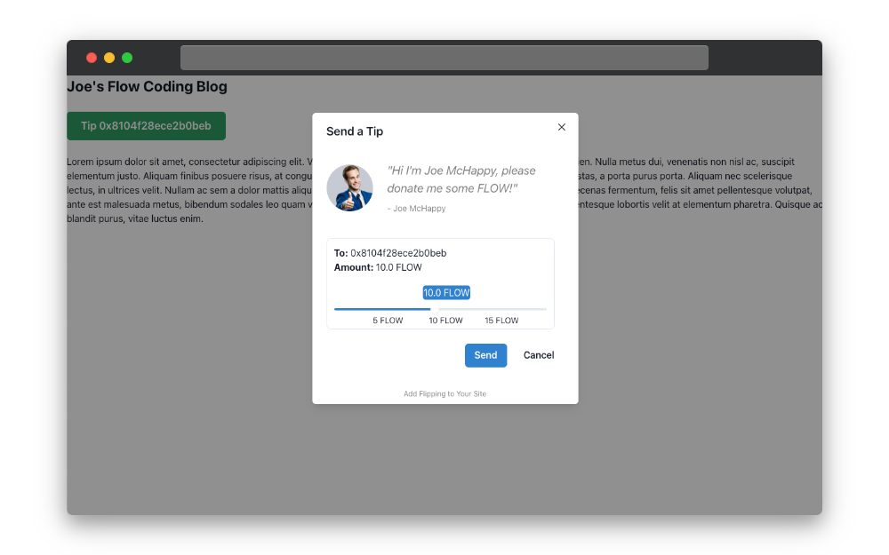

# Flipping

The Flipping Widget is a simple, easy-to-use tipping widget for the [Flow blockchain](https://flow.com/). It allows you to quickly and easily accept tips from your visitors on your website or application. This guide will walk you through the steps necessary to integrate the Flipping Widget into your site.



## Installation

**Import the CSS and JavaScript files.** Place the following lines of code in your HTML file. Typically, these lines go in the <head> section of your HTML file, but they can be placed anywhere as long as they're loaded before the widget code.

```html
<link
  href="https://cdn.jsdelivr.net/gh/chasefleming/flipping@latest/widget/index.css"
  rel="stylesheet"
/>
<script src="https://cdn.jsdelivr.net/gh/chasefleming/flipping@latest/widget/index.js"></script>
```

## Usage

**Embed the widget** into your website or application by adding the following HTML snippet where you want the widget to appear.

```html
<div
  data-address="0x123"
  data-amount="5.0"
  data-name="Joe Schmo"
  data-message="Hi I'm Joe Schmo, please donate!"
  class="flipping-widget"
  data-bg-color="blue"
></div>
```

Here's what each attribute does:

- `id`: This attribute is used to uniquely identify each Flipping Widget instance. This needs to be unique if you have multiple instances on the same page.
  data-address: This is your Flow blockchain address where the tips will be sent.
  data-amount: This is the default tipping amount. Visitors can change this if they wish.
- `data-name`: This is your display name. This will be shown on the widget.
- `data-message`: This is a message to your visitors. You can use it to thank them for their donation or to encourage them to donate.
- `data-bg-color`: This changes the background color of the widget. This should be any valid CSS color value. (_accepts most common color names...e.g. blue, red, green, etc._)
- `data-size`: This changes the size of the widget. This should be either `xs`, `sm`, `md`, or `lg`.
